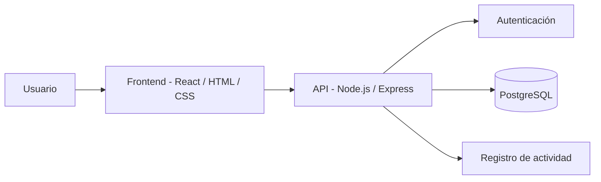

# TaskFlow


Gestión de tareas eficiente para equipos colaborativos.

## Tabla de contenidos
- [Descripción](#descripción)
- [Funcionalidades](#funcionalidades)
- [Tecnologías utilizadas](#tecnologías-utilizadas)
- [Requisitos](#requisitos)
- [Instalación](#instalación)
- [Capturas de pantalla](#capturas-de-pantalla)
- [Arquitectura](#arquitectura)
- [Estructura del proyecto](#estructura-del-proyecto)
- [Contribuidores](#contribuidores)
- [Licencia](#licencia)

## Descripción
**TaskFlow** es una aplicación *sencilla e intuitiva* diseñada para organizar, asignar y realizar un seguimiento del flujo de trabajo de un equipo en tiempo real. Este proyecto busca resolver el problema de la desorganización en equipos ágiles centralizando toda la información, tareas y roles en un solo lugar, permitiendo a los líderes de proyecto tener una vista clara del progreso general.

## Funcionalidades
A continuación, el estado actual de las funcionalidades del proyecto:

- [x] Autenticación y registro de usuarios seguros.
- [x] Asignación de tareas a miembros específicos del equipo.
- [x] Priorización de tareas por urgencia e importancia (Alta, Media, Baja).
- [x] Panel principal (Dashboard) con resumen visual y métricas de progreso.
- [ ] Implementación de notificaciones por correo electrónico al cambiar estados.
- [ ] Modo oscuro nativo para la interfaz de usuario.

## Tecnologías utilizadas
El proyecto fue construido utilizando el siguiente stack tecnológico (PERN Stack):

| Categoría | Tecnología | Descripción / Uso |
| :--- | :--- | :--- |
| **Frontend** | React / HTML / CSS | Interfaz de usuario dinámica, responsiva y SPA (Single Page Application). |
| **Backend** | Node.js / Express | Construcción de la API RESTful, enrutamiento y lógica de negocio. |
| **Base de datos** | PostgreSQL | Almacenamiento relacional robusto de datos de usuarios, proyectos y tareas. |
| **Herramientas**| Git / GitHub | Control de versiones y trabajo colaborativo. |

## Requisitos
Para ejecutar este proyecto de manera local, asegúrate de tener instalado:
* [Node.js](https://nodejs.org/) (v18.0.0 o superior)
* [npm](https://www.npmjs.com/) (v9.0.0 o superior)
* [PostgreSQL](https://www.postgresql.org/) (v14 o superior) configurado localmente.
* [Git](https://git-scm.com/)

## Instalación
Sigue estos pasos detallados para obtener una copia funcional del proyecto en tu máquina local:

1. Clona el repositorio:
   
```bash
   git clone [https://github.com/faviovergara645-cpu/taskflow.git](https://github.com/faviovergara645-cpu/taskflow.git)
```
## Capturas de pantalla

### 1. Pantalla principal (Inicio)


### 2. Pantalla de registro o inicio de sesión


### 3. Pantalla principal de la funcionalidad (Gestión de tareas)


### 4. Otra pantalla relevante

## Arquitectura

La aplicación está organizada en diferentes componentes que permiten gestionar la interacción con el usuario, la autenticación, el acceso a datos y el registro de actividades.



## Estructura del proyecto

La organización de los archivos y recursos dentro del repositorio es la siguiente:

```text
lab-05-DISAVIP/
--- ejercicio2.md        # Documentación del ejercicio 2
--- ejercicio3.md        # Documentación del ejercicio 3
--- ejercicio4.md        # Documentación del ejercicio 4
--- ejercicio5.md        # Documentación del ejercicio 5
--- funcionalidad.png    # Captura de pantalla de la funcionalidad
--- inicio.png           # Captura de pantalla de la vista principal
--- main.png             # Captura de pantalla de inicio de sesión / registro
--- otrapantalla.png     # Captura de pantalla de otra sección relevante
--- README.md            # Documentación principal del proyecto
--- REAeDME.md           # Archivo temporal de respaldo
```
## Contribuidores

El desarrollo de este proyecto ha sido posible gracias al esfuerzo y dedicación de los siguientes integrantes:

| Miembro | Rol Principal | GitHub |
| :--- | :--- | :--- |
| **Favio Vergara** | Desarrollador Full Stack | [@faviovergara645-cpu](https://github.com/faviovergara645-cpu) |

### Cómo contribuir
Si deseas unirte al desarrollo del proyecto, por favor sigue estos pasos:
1. Haz un **Fork** de este repositorio.
2. Crea una rama para tu característica (`git checkout -b feature/nueva-caracteristica`).
3. Realiza los cambios necesarios y guárdalos (`git commit -m "feat: agregar nueva característica"`).
4. Envía tus cambios a tu repositorio remoto (`git push origin feature/nueva-caracteristica`).
5. Abre un **Pull Request** para revisión.

## Licencia

Este proyecto se distribuye bajo los términos de la **Licencia MIT**. 

Puedes consultar los detalles completos de la licencia a continuación:

```text
MIT License

Copyright (c) 2026 TaskFlow Team

Por la presente se concede permiso, sin cargo, a cualquier persona que obtenga una copia
de este software y de los archivos de documentación asociados (el "Software"), para tratar
en el Software sin restricciones, incluidos, sin limitación, los derechos para usar,
copiar, modificar, fusionar, publicar, distribuir, sublicenciar y/o vender copias del Software,
y para permitir a las personas a las que se les proporcione el Software para hacerlo, sujeto a
las siguientes condiciones:

El aviso de copyright anterior y este aviso de permiso se incluirán en todas las
copias o partes sustanciales del Software.

EL SOFTWARE SE PROPORCIONA "TAL CUAL", SIN GARANTÍA DE NINGÚN TIPO, EXPRESA O
IMPLÍCITA, INCLUIDAS PERO NO LIMITADAS A GARANTÍAS DE COMERCIALIZACIÓN, IDONEIDAD
PARA UN PROPÓSITO PARTICULAR Y NO INFRACCIÓN. EN NINGÚN CASO LOS AUTORES O TITULARES
DEL COPYRIGHT SERÁN RESPONSABLES DE NINGUNA RECLAMACIÓN, DAÑOS U OTRA RESPONSABILIDAD,
YA SEA EN UNA ACCIÓN DE CONTRATO, AGRAVIO O CUALQUIER OTRO MOTIVO, DERIVADA DE O
FUERA DEL SOFTWARE O DEL USO U OTRAS OPERACIONES EN EL SOFTWARE.